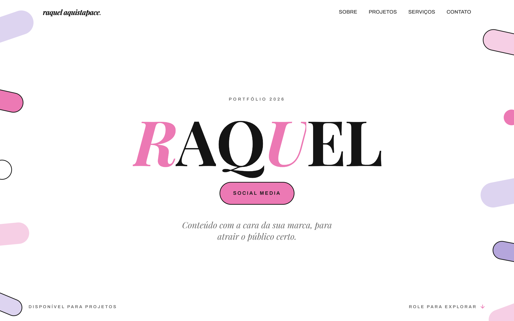

<div align="center">

# ✦ Portfólio Raquel Aquistapace ✦

**One-page editorial com estética sticker-collage**

Papel branco, tinta preta,
pílulas rosa e lavanda, serifa gigante em caixa-alta e animações em todo canto.


<br/>



</div>

---

## 🎨 Direção visual

| Token | Valor | Uso |
| --- | --- | --- |
| `pink` | `#EC79B4` | pílulas, destaques, cursor |
| `lavender` | `#B5A6DC` | pílulas alternadas |
| `ink` | quase-preto | texto, contornos 2px |
| `paper` | branco | fundo |

Tipografia: **Playfair Display** bold caixa-alta no display, **Archivo** no corpo.
Contato fecha a página num painel escuro para contraste.

## 🧱 Arquitetura (design atômico)

```text
src/
  data/portfolio.ts        ← todo o conteúdo (textos, projetos, links)
  lib/utils.ts             ← cn()
  hooks/                   ← use-lenis (scroll suave), use-magnetic, use-word-reveal
  components/
    atoms/      button, badge, eyebrow, split-words, placeholder-media, cursor
    molecules/  section-heading, marquee
    organisms/  preloader, navbar, hero, manifesto, works-list, services, contact
  App.tsx                  ← composição das seções
```

Conteúdo 100% separado da apresentação: para trocar textos, projetos ou links,

## ✨ Animações

Tudo respeita `prefers-reduced-motion`.

- **Preloader**: "PORTFÓLIO" em serifa + contador `000→100`; a cortina sobe e o reveal do hero dispara em sincronia.
- **Fundo de pílulas**: stickers fixos nas laterais com flutuação contínua, parallax de scroll em velocidades diferentes e parallax de mouse; entram em elástico após o preloader.
- **Hero collage**: letras sobem em stagger a partir de máscaras, stickers entram com `back.out` e reagem ao mouse em camadas de profundidade.
- **Cursor customizado**: ponto rosa + anel com atraso; cresce sobre links.
- **Scroll suave**: Lenis com inércia, sincronizado com o ScrollTrigger.
- **Manifesto**: texto gigante revelado palavra por palavra no scrub; retrato com reveal bruto (foto sobe de dentro da máscara, base em semicírculo) + parallax.
- **Projetos**: lista editorial com âncoras de scroll: a linha que cruza o centro da tela vira o item ativo e o preview aparece ancorado nela, sem depender do mouse; no hover o preview segue o cursor com rotação por velocidade; no mobile a mídia é inline.
- **Serviços**: faixa de texto vazado que anda com o scroll + linhas em stagger.
- **Contato**: painel escuro entra como cortina com botão circular magnético.

## 🛠 Stack

- [Vite](https://vite.dev) + [React 19](https://react.dev) + TypeScript
- [Tailwind CSS v4](https://tailwindcss.com): tokens via CSS, sem config JS
- [GSAP](https://gsap.com) + ScrollTrigger: timelines, scrub e âncoras de scroll
- [Lenis](https://lenis.darkroom.engineering): scroll suave
- Padrões shadcn (`cn`, CVA) nos componentes base
